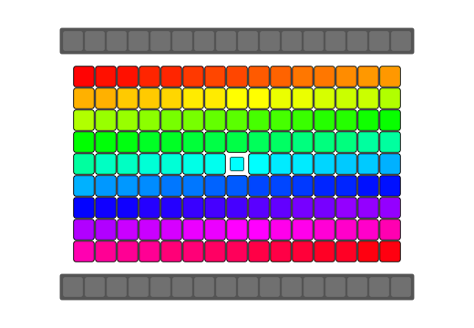
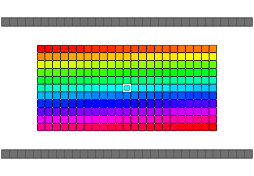
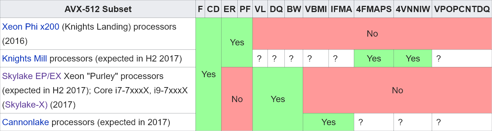

# qReverse [](https://raw.githubusercontent.com/Wunkolo/qreverse/master/LICENSE)

qReverse is an architecture-accelerated array reversal algorithm intended as a personal study to design a fast AoS reversal algorithm utilizing SIMD.

|||||||
|:-:|:-:|:-:|:-:|:-:|:-:|
||Serial|bswap/rev|SSSE3/Neon|AVX2|AVX512
|Pattern||||||
|Processor|Speedup|||||
|[i9-7900x](https://en.wikichip.org/wiki/intel/core_i9/i9-7900x)|x1|x15.386|x10.417|x22.032|x22.357|
|[i3-6100](https://en.wikichip.org/wiki/intel/core_i3/i3-6100)|x1|x15.8|x10.5|x16.053|-|
|[i5-8600K](https://en.wikichip.org/wiki/intel/core_i5/i5-8600k)|x1|x15.905|x10.21|x16.076|-|
|[E5-2697 v4](https://en.wikichip.org/wiki/intel/core_i5/i5-8600k)|x1|x16.701|x15.716|x19.141|-|
|[BCM2837](https://en.wikipedia.org/wiki/Broadcom_Corporation#Raspberry_Pi)|x1|x7.391|x7.718|-|-|


---

Array reversal implementations typically involve swapping both ends of the array and working down to the middle-most elements. C++ being type-aware treats array elements as objects and will call overloaded class operators such as `operator=` or a `copy by reference` constructor where available. Many implementations of a "swap" function would use an intermediate temporary variable to make the exchange which would require a minimum of two calls to an object's `operator=` and at least one call to an object's `copy by reference` constructor. Some other novel algorithms use the xor-swap technique after making some assumptions about the data being swapped(integer-data, register-bound, no overrides, etc). `std::swap` also allows an overload of `swap` for a type to be used if it is within the same namespace as your type should you want to expose your overloaded method to C++'s standard algorithm library during the reversal

```cpp
// Taken from http://en.cppreference.com/w/cpp/algorithm/reverse
// Example of using std::reverse
#include <vector>
#include <iostream>
#include <iterator>
#include <algorithm>
 
int main()
{
	std::vector<int> v({1,2,3});
	std::reverse(std::begin(v), std::end(v));
	std::cout << v[0] << v[1] << v[2] << '\n';

	int a[] = {4, 5, 6, 7};
	std::reverse(std::begin(a), std::end(a));
	std::cout << a[0] << a[1] << a[2] << a[3] << '\n';
}
```

Note that for an odd-numbered amount of elements the middle-most element is already exactly where it needs to be and doesn't need to be moved.


Should `std::reverse` be called upon a "**P**lain **O**l **D**ata"(POD) type such as `std::uint8_t`(aka `unsigned char`) or a plain `struct` type then compilers can safely assume that your data doesn't have any special assignment/copy overrides to worry about and can treated as raw bytes. This assumption can allow for the compiler to optimize the reversal routine into something simple and much more `memcpy`-like.

The emitted x86 of a `std::reverse` on an array of `std::uint8_t` generally looks something like this.

```x86asm
         ; std::reverse for std::uint8_t
         0x000014a0 cmp rsi, rdi
     /=< 0x000014a3 je 0x14c5
     |   0x000014a5 sub rsi, 1
     |   0x000014a9 cmp rdi, rsi
    /==< 0x000014ac jae 0x14c5
   .---> 0x000014ae movzx eax, byte [rdi] ; Load two bytes, one from
   |||   0x000014b1 movzx edx, byte [rsi] ; each end.
   |||   0x000014b4 mov byte [rdi], dl    ; Write them at opposite
   |||   0x000014b6 mov byte [rsi], al    ; ends.
   |||   0x000014b8 add rdi, 1            ; Shift index at
   |||   0x000014bc sub rsi, 1            ; both ends "inward" toward the middle
   |||   0x000014c0 cmp rdi, rsi
   \===< 0x000014c3 jb 0x14ae
    \\-> 0x000014c5 ret
```

When making qReverse, the primary interface implements a templated algorithm that follows the same logic.
The element-size at compile-time will be templated and emit a pseudo-structure that fits this exact size in an attempt to keep this illustrative implementation as generic as possible for an element of _any_ size in bytes. By having the element-size be templated it will be a lot easier to implement specializations for certain element-sizes while all other non-specialized element sizes fall-back to the serial algorithm.
Doing this with a template allows only the proper specializations to be instanced at compile-time as opposed to comparing an element-size variable against a list of available implementations at run-time.

```cpp
template< std::size_t ElementSize >
inline void qReverse(void* Array, std::size_t Count)
{
	// An abstraction to treat the array elements as raw bytes
	struct ByteElement
	{
		std::uint8_t u8[ElementSize];
	};
	ByteElement* ArrayN = reinterpret_cast<ByteElement*>(Array);
	
	// If compiler adds any padding/alignment bytes(and some do) then assert out
	static_assert(
		sizeof(ByteElement) == ElementSize,
		"ByteElement is pad-aligned and does not match specified element size"
	);
	
	// Only iterate through half of the size of the Array
	for( std::size_t i = 0; i < Count / 2; ++i )
	{
		// Exchange the upper and lower element as we work our
		// way down to the middle from either end
		ByteElement Temp(ArrayN[i]);
		ArrayN[i] = ArrayN[Count - i - 1];
		ArrayN[Count - i - 1] = Temp;
	}
}
```

Emitted assemblies from gcc with certain template specializations:

> ```cpp
> auto Reverse8 = qReverse<1>;
> ```
> ```x86asm
> void qReverse<1ul>(void*, unsigned long):
>   mov rcx, rsi
>   shr rcx
>   je .L1
>   lea rdx, [rsi-1]
>   lea rax, [rdi+rdx]
>   sub rdx, rcx
>   lea rdx, [rdi+rdx]
> .L3:
>   movzx ecx, BYTE PTR [rdi] ; Load bytes at each end
>   movzx esi, BYTE PTR [rax]
>   sub rax, 1                ; Move indexs "inwards"
>   add rdi, 1
>   mov BYTE PTR [rdi-1], sil ; Place them at the other end
>   mov BYTE PTR [rax+1], cl
>   cmp rax, rdx              ; Loop
>   jne .L3
> .L1:
>   rep ret
> ```

> ```cpp
> auto Reverse16 = qReverse<2>;
> ```
> ```x86asm
> void qReverse<2ul>(void*, unsigned long):
>   mov rdx, rsi
>   shr rdx
>   je .L17
>   lea rax, [rdi-2+rsi*2]
>   add rdx, rdx
>   mov rsi, rax
>   sub rsi, rdx
> .L12:
>   movzx edx, WORD PTR [rdi] ; Same as above
>   movzx ecx, WORD PTR [rax]
>   sub rax, 2
>   add rdi, 2
>   mov WORD PTR [rdi-2], cx
>   mov WORD PTR [rax+2], dx
>   cmp rax, rsi
>   jne .L12
> .L17:
>   rep ret
> ```

> ```cpp
> auto Reverse32 = qReverse<4>;
> ```
> ```x86asm
> void qReverse<4ul>(void*, unsigned long):
>   mov rdx, rsi
>   shr rdx
>   je .L25
>   lea rax, [rdi-4+rsi*4]
>   sal rdx, 2
>   mov rsi, rax
>   sub rsi, rdx
> .L20:
>   mov edx, DWORD PTR [rdi] ; Same as above
>   mov ecx, DWORD PTR [rax]
>   sub rax, 4
>   add rdi, 4
>   mov DWORD PTR [rdi-4], ecx
>   mov DWORD PTR [rax+4], edx
>   cmp rax, rsi
>   jne .L20
> .L25:
>   rep ret
> ```

> ```cpp
> auto Reverse24 = qReverse<3>;
> ```
> ```x86asm
> void qReverse<3ul>(void*, unsigned long):
>   mov rdx, rsi
>   shr rdx
>   je .L25
>   lea rax, [rsi-3+rsi*2]
>   lea rdx, [rdx+rdx*2]
>   add rax, rdi
>   mov r8, rax
>   sub r8, rdx
> .L20:
>   movzx esi, WORD PTR [rax] ; Due to the element being 3 bytes
>   movzx ecx, WORD PTR [rdi] ; The arithmetic gets especially weird
>   sub rax, 3                ; But it is still the same
>   movzx edx, BYTE PTR [rdi+2]
>   add rdi, 3
>   mov WORD PTR [rdi-3], si
>   movzx esi, BYTE PTR [rax+5]
>   mov WORD PTR [rsp-3], cx
>   mov BYTE PTR [rsp-1], dl
>   mov BYTE PTR [rdi-1], sil
>   mov WORD PTR [rax+3], cx
>   mov BYTE PTR [rax+5], dl
>   cmp rax, r8
>   jne .L20
> .L25:
>   rep ret
> ```

**From here it gets better!**

This "plain ol data" assumption can be made for lots of different types of data. Most usages of `struct` are intended to be treated as "bags of data" and do not have the limitation of additional memory-movement logic for copying or swapping since they are intended only to communicate a structure of interpretation of bytes. The more obvious case-study can also be having an array of `chars` found in an ASCII `string` or maybe a row of `uint32_t` pixel data. If the array elements are aligned to register-sizes(which tend to be powers of 2) then these in-register byte swaps and shuffling can be especially useful. **From this point on assume that the array of data is to be interpreted as these "bags of data" instances** that do not involve any kind of `operator=` or `Foo (const Foo&)` type of overhead logic so the data may be safely interpreted strictly as bytes, think `memcpy`-like.

Most of the market are running 64-bit or 32-bit machines or have register sizes that are easily much bigger than just 1 byte(the animation above had register sizes that are 4 bytes, which is the size of a single 32-bit register). An observation is that this can speed this up is by loading in a full register-sized chunk of bytes, flipping this chunk of bytes within the register, and then placing it on the other end! Swapping all the bytes in the registers is a popular operation in networking called an `endian swap` and x86 happens to have just the instruction to do this!

# bswap

The `bswap` instruction reverses the individual bytes of a register and is typically used to swap the `endian` of an integer to exchange between `host` and `network` byte-order(see `htons`,`htonl`,`ntohs`,`ntohl`). Most x86 compilers implement assembly intrinsics that you can put right into your C or C++ code to get the compiler to emit the `bswap` instruction directly:

**MSVC:**
- `_byteswap_uint64`
- `_byteswap_ulong`
- `_byteswap_ushort`

**GCC/Clang:**

- `_builtin_bswap64`
- `_builtin_bswap32`
- `_builtin_bswap16`

The x86 header `immintrin.h` also includes `_bswap` and `_bswap64`. Otherwise a more generic and portable implementation can be used as well to be more architecture-generic.

```cpp
inline std::uint64_t Swap64(std::uint64_t x)
{
	return (
		((x & 0x00000000000000FF) << 56) |
		((x & 0x000000000000FF00) << 40) |
		((x & 0x0000000000FF0000) << 24) |
		((x & 0x00000000FF000000) <<  8) |
		((x & 0x000000FF00000000) >>  8) |
		((x & 0x0000FF0000000000) >> 24) |
		((x & 0x00FF000000000000) >> 40) |
		((x & 0xFF00000000000000) >> 56)
	);
}

inline std::uint32_t Swap32(std::uint32_t x)
{
	return(
		((x & 0x000000FF) << 24) |
		((x & 0x0000FF00) <<  8) |
		((x & 0x00FF0000) >>  8) |
		((x & 0xFF000000) >> 24)
	);
}

inline std::uint16_t Swap16(std::uint16_t x)
{
	// This tends to emit a 16-bit `rol` or `ror` instruction
	return (
		((x & 0x00FF) <<  8) |
		((x & 0xFF00) >>  8)
	);
}
```

Most compilers are able to detect when an in-register endian-swap is being done like above and will emit `bswap` automatically or a similar intrinsic for your target architecture(The ARM architecture has the `rev` instruction for **armv6** or newer). Note also that `bswap16` is basically just a 16-bit rotate of 1 byte which is the `rol` or `ror` instruction.

x86_64 (gcc):
```x86asm
Swap64(unsigned long):
  mov rax, rdi
  bswap rax
  ret
Swap32(unsigned int):
  mov eax, edi
  bswap eax
  ret
Swap16(unsigned short):
  mov eax, edi
  rol ax, 8
  ret
```

x86_64 (clang):
```x86asm
Swap64(unsigned long): # @Swap64(unsigned long)
  bswap rdi
  mov rax, rdi
  ret

Swap32(unsigned int): # @Swap32(unsigned int)
  bswap edi
  mov eax, edi
  ret

Swap16(unsigned short): # @Swap16(unsigned short)
  rol di, 8
  mov eax, edi
  ret
```

ARM64 (gcc):
```armasm
Swap64(unsigned long):
  rev x0, x0
  ret
Swap32(unsigned int):
  rev w0, w0
  ret
Swap16(unsigned short):
  rev16 w0, w0
  ret
```


Using 32-bit `bswap`s, the algorithm can take a 4-byte _chunk_ of bytes from either end into registers, `bswap` the register, and then place the reversed _chunks_ at the opposite ends. As the algorithm gets closer to the center it can use smaller 16-bit swaps(aka a 16-bit rotate) should it encounter 2-byte chunks and eventually do serial swaps to anything left over.


and this of course can be expanded into a 64-bit `bswap` on a 64-bit architecture allowing for even larger chunks to be reversed at once. Once again, first exhaust as many 8-byte swaps, as possible, then do the 4-byte swaps, then the two-2byte swaps, and finally fallback onto the serial 1-byte swaps if need be:


Given an array of `11` bytes to be reversed(odd number, so the middle byte stays the same), divide the array size by two to get the number of _single-element_ swaps to do(using whole-integer arithmetic):

> `11 / 2 = 5`

So `5` single-element serial swaps are needed to reverse this array. Now that there is a way to do `4` element chunks at once too, integer-divide this result `5` again by `4` to know how many _four-element_ swaps needed. The remainder of this division is the number of serial swaps still needed once all the four-element swaps have been exhausted:

> `5 / 4 = 1`
> 
> `5 % 4 = 1`

So only one 4-byte `bswap`-swap and one `naive`-swap is needed to fully reverse an 11-element array. Now the 1-byte qReverse template specialization can be added.

```cpp
// Reverse an array of 1-byte elements(such as std::uint8_t)

// A specialization of the above implementation for 1-byte elements
// Does not call assignment or copy overloads
// Accelerated using - 64,32 and 16 bit bswap instructions
template<>
inline void qReverse<1>(void* Array, std::size_t Count)
{
	std::uint8_t* Array8 = reinterpret_cast<std::uint8_t*>(Array);
	std::size_t i = 0;

	// Using a new iteration variable "j" to illustrate that we know
	// the exact amount of times we have to use our chunk-swaps
	// BSWAP 64
	for( std::size_t j = i / 8; j < ((Count / 2) / 8); ++j )
	{
		// Get bswapped versions of our Upper and Lower 8-byte chunks
		std::uint64_t Lower = Swap64(
			*reinterpret_cast<std::uint64_t*>(&Array8[i])
		);
		std::uint64_t Upper = Swap64(
			*reinterpret_cast<std::uint64_t*>(&Array8[Count - i - 8])
		);

		// Place them at their swapped position
		*reinterpret_cast<std::uint64_t*>(&Array8[i]) = Upper;
		*reinterpret_cast<std::uint64_t*>(&Array8[Count - i - 8]) = Lower;

		// Eight elements at a time
		i += 8;
	}
	// BSWAP 32
	for( std::size_t j = i / 4; j < ((Count / 2) / 4); ++j )
	{
		// Get bswapped versions of our Upper and Lower 4-byte chunks
		std::uint32_t Lower = Swap32(
			*reinterpret_cast<std::uint32_t*>(&Array8[i])
		);
		std::uint32_t Upper = Swap32(
			*reinterpret_cast<std::uint32_t*>(&Array8[Count - i - 4])
		);

		// Place them at their swapped position
		*reinterpret_cast<std::uint32_t*>(&Array8[i]) = Upper;
		*reinterpret_cast<std::uint32_t*>(&Array8[Count - i - 4]) = Lower;

		// Four elements at a time
		i += 4;
	}
	// BSWAP 16
	for( std::size_t j = i / 2; j < ((Count / 2) / 2); ++j )
	{
		// Get bswapped versions of our Upper and Lower 4-byte chunks
		std::uint16_t Lower = Swap16(
			*reinterpret_cast<std::uint16_t*>(&Array8[i])
		);
		std::uint16_t Upper = Swap16(
			*reinterpret_cast<std::uint16_t*>(&Array8[Count - i - 2])
		);

		// Place them at their swapped position
		*reinterpret_cast<std::uint16_t*>(&Array8[i]) = Upper;
		*reinterpret_cast<std::uint16_t*>(&Array8[Count - i - 2]) = Lower;

		// Two elements at a time
		i += 2;
	}
	// Everything else that we can not do a bswap on, we swap normally
	// Naive swaps
	for( ; i < Count / 2; ++i )
	{
		// Exchange the upper and lower element as we work our
		// way down to the middle from either end
		std::uint8_t Temp(Array8[i]);
		Array8[i] = Array8[Count - i - 1];
		Array8[Count - i - 1] = Temp;
	}
}
```

On some architectures and compilers, the [movebe](https://www.felixcloutier.com/x86/MOVBE.html) instruction may be emitted which is a CPU instruction that can either read OR write from a memory location AND swap the endian of it, all in one instruction. This instruction is supported since the `haswell` architecture of intel processors and `excavator` architecture of AMD processors and will be used automatically if you use `-march=native` with a processor that supports it.

And now some benchmarks: on a _i3-6100_ with _8gb of DDR4 ram_. I automated the benchmark process across several different array-sizes giving each array-size `10,000` array-reversal trials before getting an average execution time for the given array-size. Using g++ compile flags: `-m64 -Ofast -march=native` these are the results of comparing the execution time of the current bswap `qreverse` algorithm against `std::reverse`:

Element Count|std::reverse|qReverse|Speedup Factor
---|---|---|---
8|19 ns|19 ns|*1.000*
16|20 ns|19 ns|**1.053**
32|24 ns|23 ns|**1.043**
64|36 ns|23 ns|**1.565**
128|54 ns|21 ns|**2.571**
256|90 ns|22 ns|**4.091**
512|159 ns|26 ns|**6.115**
1024|298 ns|35 ns|**8.514**
100|43 ns|21 ns|**2.048**
1000|290 ns|36 ns|**8.056**
10000|2740 ns|191 ns|**14.346**
100000|27511 ns|1739 ns|**15.820**
1000000|279525 ns|24710 ns|**11.312**
59|32 ns|22 ns|**1.455**
79|43 ns|27 ns|**1.593**
173|63 ns|29 ns|**2.172**
6133|1680 ns|127 ns|**13.228**
10177|2784 ns|190 ns|**14.653**
25253|6864 ns|455 ns|**15.086**
31391|8548 ns|564 ns|**15.156**
50432|13897 ns|875 ns|**15.882**


And so across the board there are speedups up to _**x15.8!**_ before dipping down a bit for the more larger array sizes potentially due to the accumulation of cache misses with such large amounts of data. The algorithm reaches out to either end of a potentially massive array which lends itself to an accumulation of cache misses at some point. Still a _very_ large and significant speedup over `std::reverse` consistantly without trying to do some `_mm_prefetch` arithmetic to get the cache to behave.

# SIMD

The `bswap` instruction can reverse the byte-order of `2`, `4`, or `8` bytes, but several x86 extensions later and now it is possible to swap the byte order of `16`, `32`, even `64` bytes all at once through the use of `SIMD`. `SIMD` stands for *Single Instruction Multiple Data* and allows operation upon multiple lanes of data in parallel using only a single instruction. Much like `bswap` which atomically reverses all four bytes in a register, `SIMD` provides an entire instruction set of arithmetic that allows manipulation of multiple instances of data at once in parallel using a single instruction. These chunks of data that are operated upon tend to be called `vectors` of data. Multiple bytes of data can then be elevated into a `vector` register to reverse its order and place it on the opposite end similarly to the `bswap` implementation but with even larger chunks.

These additions to the algorithm will span higher-width chunks of bytes and will be append above the chain of `bswap` accelerated swap-loops to esure that the largest swaps are exhausted first before the smaller ones. Over the years the x86 architecture has seen many generations of `SIMD` implementations, improvements, and instruciton sets:

- `MMX` (1996)
- `SSE` (1999)
- `SSE2` (2001)
- `SSE3` (2004)
- `SSSE3` (2006)
- `SSE4 a/1/2` (2006)
- `AVX` (2008)
- `AVX2` (2013)
- `AVX512` (2015)

Some are kept around for compatibilities sake(`MMX`) and some are so recent, elusive, or so _vendor-specific_ to Intel or AMD that you're probably not likely to have a processor that features it(`SSE4a`). Some are very specific to enterprise hardware (such as `AVX512`) and are not likely to be on consumer hardware either. Other architectures may also have their own implementation of SIMD such as ARM's simd co-processor `NEON`.

At the moment (July 21, 2017) the steam hardware survey states that **94.42%** of all CPUs on Steam feature `SSSE3`([store.steampowered.com/hwsurvey/](http://store.steampowered.com/hwsurvey/)). `SSSE3` is what will be used as first step into higher `SIMD` territory. `SSSE3` in particular due to its `_mm_shuffle_epi8` instruction which lets allows the processor to _shuffle_ bytes within our 128-bit register with relative ease for illustrating this implementation.

# SSSE3

`SSE` stands for "Streaming SIMD Extensions" while `SSSE3` stands for "Supplemental Streaming SIMD Extensions 3" which is the _fourth_ iteration of `SSE` technology. SSE introduces registers that allow for some `128` bit vector arithmetic. In C or C++ code the intent to use these registers is represented using types such as `__m128i` or `__m128d` which tell the compiler that any notion of _storage_ for these types should find their place within the 128-bit `SSE` registers when ever possible. Intrinsics such as `_mm_add_epi8` which will add two `__m128i`s together, and treat them as a _vector_ of 8-bit elements are now available within C and C++ code. The `i` and `d` found in `__m128i` and `__m128d` are to notify intent of the 128-register's interpretation as `i`nteger and `d`ouble respectively. `__m128` is assumed to be a vector of four `floats` by default. Since integer-data is what is being operated upon, the `__m128i` data type will be used as our data representation which gives access to the `_mm_shuffle_epi8` instruction. Note that `SSSE3` requires the gcc compile flag `-mssse3`.

Now to draft a `SSSE3` byte swapping implementation and create a simulated 16-byte `bswap` using `SSSE3`. First, add `#include <tmmintrin.h>` in C or C++ code to expose every intrinsic from `MMX` up until `SSSE3` to your current source file. Then, use the instrinsic `_mm_loadu_si128` to `load` an `u`naligned `s`igned `i`nteger vector of `128` bits into a `__m128i` variable. At a hardware level, _unaligned_ data and _aligned_ data interfaces with the memory hardware slightly differently and can provide for some further slight speedups should data-alignment be guarenteed. No assumption can be made about the alignment of the pointers being passed to qReverse so unaligned memory access will be used. When done with the vector-arithmetic, call an equivalent `_mm_storeu_si128` which stores the vector data into an unaligned memory address. This `SSSE3` implementation will go right above the previous `Swap64` implementation, ensuring that our algorithm exhausts as much of the larger chunks as possible before resorting to the smaller ones:

```cpp
#include <tmmintrin.h>

...
for( std::size_t j = i / 16; j < ((Count / 2) / 16); ++j )
{
	const __m128i ShuffleRev = _mm_set_epi8(
		0, 1, 2, 3, 4, 5, 6, 7, 8, 9, 10, 11, 12, 13, 14, 15
	);
	// Load 16 elements at once into one 16-byte register
	__m128i Lower = _mm_loadu_si128(
		reinterpret_cast<__m128i*>(&Array8[i])
	);
	__m128i Upper = _mm_loadu_si128(
		reinterpret_cast<__m128i*>(&Array8[Count - i - 16])
	);

	// Reverse the byte order of our 16-byte vectors
	Lower = _mm_shuffle_epi8(Lower, ShuffleRev);
	Upper = _mm_shuffle_epi8(Upper, ShuffleRev);

	// Place them at their swapped position
	_mm_storeu_si128(
		reinterpret_cast<__m128i*>(&Array8[i]),
		Upper
	);
	_mm_storeu_si128(
		reinterpret_cast<__m128i*>(&Array8[Count - i - 16]),
		Lower
	);

	// 16 elements at a time
	i += 16;
}
// Right above the Swap64 implementation...
for( std::size_t j = i / 8; j < ( (Count/2) / 8 ) ; ++j)
...
```

This basically implements a beefed-up 16-byte `bswap` using `SSSE3`. The heart of it all is the `_mm_shuffle_epi8` instruction which _shuffles_ the vector in the first argument according to the vector of byte-indices found in the second argument and returns this new _shuffled_ vector. A constant vector `ShuffleRev` is declared using `_mm_set_epi8` with each byte set to the index of where it should get its byte from(starting from least significant byte). You might read it as going from 0 to 15 in ascending order but this is actually indexing the bytes in reverse order which gives a fully reversed 16-bit sub-array of bytes.


Now for some speed tests.

Element Count|std::reverse|qReverse|Speedup Factor
---|---|---|---
8|19 ns|19 ns|*1.000*
16|22 ns|20 ns|**1.100**
32|27 ns|20 ns|**1.350**
64|37 ns|21 ns|**1.762**
128|55 ns|23 ns|**2.391**
256|91 ns|24 ns|**3.792**
512|158 ns|31 ns|**5.097**
1024|297 ns|42 ns|**7.071**
100|43 ns|21 ns|**2.048**
1000|291 ns|42 ns|**6.929**
10000|2743 ns|261 ns|**10.510**
100000|27523 ns|2966 ns|**9.280**
1000000|279812 ns|33832 ns|**8.271**
59|32 ns|21 ns|**1.524**
79|43 ns|24 ns|**1.792**
173|62 ns|29 ns|**2.138**
6133|1683 ns|185 ns|**9.097**
10177|2787 ns|291 ns|**9.577**
25253|6862 ns|712 ns|**9.638**
31391|8546 ns|916 ns|**9.330**
50432|13893 ns|1497 ns|**9.281**


Speedups of up to _**x10.5**_!... but this is lower than the `bswap` version which reached up to _**x15.8**_? Maybe some loop unrolling or some prefetching might help this algorithm play nice with the cache. In this implementation only two out of the available 8 registers are being used as well so there is some great room for improvement(Todo)

# AVX2

The implementation can go even further to work with the even larger 256-bit registers that the `AVX/AVX2` extension provides and reverse *32 byte chunks* at a time. The implementation is very similar to the `SSSE3` one: load in *unaligned* data into a 256-bit register using the `__m256i` type. The issue with `AVX/AVX2` is that the `256-bit` register is actually two individual `128-bit` _lanes_ being operated in parallel as one larger `256-bit` register and overlaps in functionality with the `SSE` register almost as an additional layer of abstraction added upon `SSE`. Now here's where things get tricky, there is no `_mm256_shuffle_epi8` instruction that works like you'd think it would. Since it's just operating on two 128-bit lanes in parallel, `AVX/AVX2` instructions introduces a limitation in which some cross-lane arithmetic requires special cross-lane attention. Some instructions will accept 256-bit `AVX` registers but only actually operates upon 128-bit lanes. The trick here is that rather than trying to reverse a 256-bit register atomically in one go, instead reverse the bytes within the two 128-bit lanes, as if shuffling two 128-bit registers like in the `SSSE3` implementation, and then reverse the two 128-bit lanes themselves with whatever cross-lane arithmetic that _is_ available in `AVX/AVX2`. Note that `AVX2` requires the gcc compile flag `-mavx2`.

[_mm256_shuffle_epi8](https://software.intel.com/sites/landingpage/IntrinsicsGuide/#techs=AVX,AVX2&text=shuffle&expand=4726) is an `AVX2` instruction that shuffles the two 128-bit lanes of the 256-bit register much like the `SSSE3` intrinsic so this can be taken care of first.

```cpp
const __m256i ShuffleRev = _mm256_set_epi8(
	0, 1, 2, 3, 4, 5, 6, 7, 8, 9,10,11,12,13,14,15, // first 128-bit lane
	0, 1, 2, 3, 4, 5, 6, 7, 8, 9,10,11,12,13,14,15  // second 128-bit lane
);
// Load 32 elements at once into one 32-byte register
__m256i Lower = _mm256_loadu_si256(
	reinterpret_cast<__m256i*>(&Array8[i])
);
__m256i Upper = _mm256_loadu_si256(
	reinterpret_cast<__m256i*>(&Array8[Count - i - 32])
);

// Reverse each the bytes in each 128-bit lane
Lower = _mm256_shuffle_epi8(Lower,ShuffleRev);
Upper = _mm256_shuffle_epi8(Upper,ShuffleRev);
```

So in the large 256-bit register, the two 128-bit lanes are now reversed, but now the 128-bit lanes themselves must be reversed. [_mm256_permute2x128_si256](https://software.intel.com/en-us/node/524015) is another `AVX2` instruction that permutes the 128-bit lanes of two 256-bit registers:


Given two big 256-bit vectors and an 8-byte immediate value it can select how the new 256-bit vector it builds is going to be assembled. Pass in the same variable for both of the arguments and "picking" from them as if they were just 2-element arrays of 16-byte elements can simulate a big 128-bit cross-lane swap(think of it like `__m128i SomeAVXRegister[2]` and going `SomeAVXRegister[0]` or `SomeAVXRegister[1]` ). In a way, this is also a big 128-bit "rotate" if you can visualize it.

```cpp
...
for( std::size_t j = i / 32; j < ((Count / 2) / 32); ++j )
{
	const __m256i ShuffleRev = _mm256_set_epi8(
		0, 1, 2, 3, 4, 5, 6, 7, 8, 9,10,11,12,13,14,15,
		0, 1, 2, 3, 4, 5, 6, 7, 8, 9,10,11,12,13,14,15
	);
	// Load 32 elements at once into one 32-byte register
	__m256i Lower = _mm256_loadu_si256(
		reinterpret_cast<__m256i*>(&Array8[i])
	);
	__m256i Upper = _mm256_loadu_si256(
		reinterpret_cast<__m256i*>(&Array8[Count - i - 32])
	);

	// Reverse the bytes inside each of the two 16-byte lanes
	Lower = _mm256_shuffle_epi8(Lower,ShuffleRev);
	Upper = _mm256_shuffle_epi8(Upper,ShuffleRev);

	// Reverse the order of the 16-byte lanes
	Lower = _mm256_permute2x128_si256(Lower,Lower,1);
	Upper = _mm256_permute2x128_si256(Upper,Upper,1);

	// Place them at their swapped position
	_mm256_storeu_si256(
		reinterpret_cast<__m256i*>(&Array8[i]),
		Upper
	);
	_mm256_storeu_si256(
		reinterpret_cast<__m256i*>(&Array8[Count - i - 32]),
		Lower
	);

	// 32 elements at a time
	i += 32;
}
// Right above the SSSE3 implementation
...
```


Benchmarks:

Element Count|std::reverse|qReverse|Speedup Factor
---|---|---|---
8|19 ns|19 ns|*1.000*
16|21 ns|21 ns|*1.000*
32|26 ns|20 ns|**1.300**
64|37 ns|22 ns|**1.682**
128|54 ns|20 ns|**2.700**
256|91 ns|24 ns|**3.792**
512|159 ns|27 ns|**5.889**
1024|298 ns|36 ns|**8.278**
100|45 ns|20 ns|**2.250**
1000|292 ns|36 ns|**8.111**
10000|2739 ns|189 ns|**14.492**
100000|27515 ns|1714 ns|**16.053**
1000000|279701 ns|25417 ns|**11.004**
59|32 ns|21 ns|**1.524**
79|44 ns|25 ns|**1.760**
173|63 ns|29 ns|**2.172**
6133|1681 ns|127 ns|**13.236**
10177|2782 ns|192 ns|**14.490**
25253|6863 ns|449 ns|**15.285**
31391|8545 ns|556 ns|**15.369**
50432|13888 ns|875 ns|**15.872**


A speedup of up to _**x16.053**_!

# AVX512

`AVX512` is particularly rare out in the commercial world. Even so, the algorithm cant take that much more of a step forward and operate upon massive 512-bit bit registers. This will allow a swap `64` of bytes of data at once. At the moment, C and C++ compiler implementations of the `AVX512` instruction set are spotty at best. There is the benefit of the [_mm512_shuffle_epi8](https://software.intel.com/sites/landingpage/IntrinsicsGuide/#expand=4729,4753&text=_mm512_shuffle_epi8) instruction that will allow the shuffling of the four 128-lane registers within the 512-bit register with 8-bit indexes though there is not a confident implementation of [_mm512_set_epi8](https://software.intel.com/sites/landingpage/IntrinsicsGuide/#=undefined&avx512techs=AVX512F&expand=4726,4038,4594,4594,4618,4618&text=_mm512_set_epi8) to be found in MSVC or GCC. There is [_mm512_set_epi32](https://software.intel.com/sites/landingpage/IntrinsicsGuide/#=undefined&expand=4726,4038,4594,4594,4618,4618,4618,4611&text=_mm512_set_epi32&avx512techs=AVX512F) which will require generation of the `ShuffleRev` constant to use 32-bit integers rather than 8-bit integers. After the initial `_mm512_shuffle_epi8` the four lanes still must be reversed due to the need for cross-lane arithmetic so an additional [_mm512_permutexvar_epi64](https://software.intel.com/sites/landingpage/IntrinsicsGuide/#expand=4726,4594,4729,3972,4029,4029,3930,4729,3930,4029,4589,4029,4029,4047,4047&avx512techs=AVX512F&text=_mm512_permutexvar_epi64) is needed to truely complete the reversal. This is similar to what had to be done for the `AVX2` implementation above.

`AVX512` is not a single set of instructions. `AVX512` has different subsets which may or may not be implemented for a specified processor. For example there is `AVX512CD` for conflict detection and `AVX512ER` for exponential and reciprocal instructions though ALL implementations of `AVX512` _require_ that `AVX512F`(AVX-512 Foundation) be implemented. `_mm512_shuffle_epi8` is an instruction implemented by the `AVX512BW` subset which adds **B**yte and **W**ord operations while `_mm512_setepi32` and `_mm512_permutexvar_epi64` are `AVX512F` so `_mm512_shuffle_epi8` is the only "stretch" requirement involved here. `AVX512BW` is currently supported by the current Skylake Enthusiast processors and is planned for the future Cannonlake processors. For reference, a current map of `AVX512` subset implementations(as of September 3, 2017).



In GCC, specific subsets of `AVX512` must be enabled using compile flags:

Subset|Flag
-|-
**Foundation**|`-mavx512f`
Prefetch|`-mavx512pf`
Exponential/Reciprocal|`-mavx512er`
Conflict Detection|`-mavx512cd`
Vector Length|`-mavx512vl`
**Byte And Word**|`-mavx512bw`
Doubleword and Quadword|`-mavx512dq`
*Integer Fused Multiply Add*|`-mavx512ifma`
*Vector Byte Manipulation*|`-mavx512vbmi`


`_mm512_shuffle_epi8` and requires the `-mavx512bw` flag to compile in gcc while the rest only requires `-mavx512f`.

```cpp
// Could have done:
const __m512i ShuffleRev = _mm512_set_epi8(
	0, 1, 2, 3, 4, 5, 6, 7, 8, 9, 10, 11, 12, 13, 14, 15,
	0, 1, 2, 3, 4, 5, 6, 7, 8, 9, 10, 11, 12, 13, 14, 15,
	0, 1, 2, 3, 4, 5, 6, 7, 8, 9, 10, 11, 12, 13, 14, 15,
	0, 1, 2, 3, 4, 5, 6, 7, 8, 9, 10, 11, 12, 13, 14, 15
);
// but instead have to do the more awkward:
const __m512i ShuffleRev = _mm512_set_epi32(
	0x00010203, 0x4050607, 0x8090a0b, 0xc0d0e0f,
	0x00010203, 0x4050607, 0x8090a0b, 0xc0d0e0f,
	0x00010203, 0x4050607, 0x8090a0b, 0xc0d0e0f,
	0x00010203, 0x4050607, 0x8090a0b, 0xc0d0e0f
);
```

The full `AVX512` implementation:

```cpp
...
	for( std::size_t j = i / 64; j < ((Count / 2) / 64); ++j )
	{
		// Reverses the 16 bytes of the four  128-bit lanes in a 512-bit register
		const __m512i ShuffleRev8 = _mm512_set_epi32(
			0x00010203, 0x4050607, 0x8090a0b, 0xc0d0e0f,
			0x00010203, 0x4050607, 0x8090a0b, 0xc0d0e0f,
			0x00010203, 0x4050607, 0x8090a0b, 0xc0d0e0f,
			0x00010203, 0x4050607, 0x8090a0b, 0xc0d0e0f
		);

		// Reverses the four 128-bit lanes of a 512-bit register
		const __m512i ShuffleRev64 = _mm512_set_epi64(
			1,0,3,2,5,4,7,6
		);

		// Load 64 elements at once into one 64-byte register
		__m512i Lower = _mm512_loadu_si512(
			reinterpret_cast<__m512i*>(&Array8[i])
		);
		__m512i Upper = _mm512_loadu_si512(
			reinterpret_cast<__m512i*>(&Array8[Count - i - 64])
		);

		// Reverse the byte order of each 128-bit lane
		Lower = _mm512_shuffle_epi8(Lower,ShuffleRev8);
		Upper = _mm512_shuffle_epi8(Upper,ShuffleRev8);

		// Reverse the four 128-bit lanes in the 512-bit register
		Lower = _mm512_permutexvar_epi64(ShuffleRev64,Lower);
		Upper = _mm512_permutexvar_epi64(ShuffleRev64,Upper);

		// Place them at their swapped position
		_mm512_storeu_si512(
			reinterpret_cast<__m512i*>(&Array8[i]),
			Upper
		);
		_mm512_storeu_si512(
			reinterpret_cast<__m512i*>(&Array8[Count - i - 64]),
			Lower
		);

		// 64 elements at a time
		i += 64;
	}
	// Above the AVX2 implementation
...
```


Since `AVX512` is pretty rare on consumer hardware at the moment: [Intel provides an emulator](https://software.intel.com/en-us/articles/intel-software-development-emulator) that can provide for some verification that the algorithm properly reverses the array. The emulator is no grounds for a proper hardware benchmark though. After creating a simple test program to verify that the array has been reversed it can be ran through the emulator and verified:

`sde64 -mix -no_shared_libs  -- ./Verify1 128`

```
Original:
0 1 2 3 4 5 6 7 8 9 10 11 12 13 14 15 16 17 18 19 20 21 22 23 24 25 26 27 28 29 30 31 32 33 34 35 36 37 38 39 40 41 42 43 44 45 46 47 48 49 50 51 52 53 54 55 56 57 58 59 60 61 62 63 64 65 66 67 68 69 70 71 72 73 74 75 76 77 78 79 80 81 82 83 84 85 86 87 88 89 90 91 92 93 94 95 96 97 98 99 100 101 102 103 104 105 106 107 108 109 110 111 112 113 114 115 116 117 118 119 120 121 122 123 124 125 126 127
Reversed:
127 126 125 124 123 122 121 120 119 118 117 116 115 114 113 112 111 110 109 108 107 106 105 104 103 102 101 100 99 98 97 96 95 94 93 92 91 90 89 88 87 86 85 84 83 82 81 80 79 78 77 76 75 74 73 72 71 70 69 68 67 66 65 64 63 62 61 60 59 58 57 56 55 54 53 52 51 50 49 48 47 46 45 44 43 42 41 40 39 38 37 36 35 34 33 32 31 30 29 28 27 26 25 24 23 22 21 20 19 18 17 16 15 14 13 12 11 10 9 8 7 6 5 4 3 2 1 0
[PASS] Array Reversed
```

The `-mix` will cause the software development emulator to audit the execution of the program and the instructions it encounters into a `sde-mix-out.txt` file. This file is massive by default so `-no_shared_libs` removes the auditing of shared libraries(such as the standard libraries) from the report. With this the execution summery of `qreverse<1>` can be examined:

```
# $dynamic-counts-for-function: void qReverse<1ul>(void*, unsigned long)  IMG: /media/Alpha/Programming/qreverse/build/Verify1 at [0x4e1ffd40a0, 0x4e1ffd4e3e)   1.442%
#
# TID 0
#       opcode                 count
#
...
*isa-set-AVX512BW_512                                                  4
*isa-set-AVX512F_512                                                   6
...
*category-AVX512                                                       4
...
*avx512                                                               10
...
...
VMOVDQA64                                                              2  < Note these are called only twice which
VMOVDQU64                                                              2    makes sense given a 128-byte array
VMOVDQU8                                                               2    and only needing one AVX-512 swap
VPERMQ                                                                 2
VPSHUFB                                                                2
*total                                                                75

```

Not only are the `AVX512BW` instructions verified to have ran and worked but the entire reversal of `128` elements took only `75` instructions in total!

I recently acquired an Intel i9-7900x `BX80673I97900X` which features a large portion of the `AVX512` subsets and is capable of providing some actual hardware benchmarks for this implementation.
Here the benchmark is compiled using Visual Studio 2017 for x64-Release mode. 

Element Count|std::reverse|qReverse|Speedup Factor
---|---|---|---
8|63 ns|59 ns|**1.068**
16|62 ns|61 ns|**1.016**
32|74 ns|59 ns|**1.254**
64|104 ns|61 ns|**1.705**
128|80 ns|18 ns|**4.444**
256|90 ns|20 ns|**4.500**
512|157 ns|22 ns|**7.136**
1024|276 ns|28 ns|**9.857**
100|44 ns|20 ns|**2.200**
1000|269 ns|30 ns|**8.967**
10000|2504 ns|112 ns|**22.357**
100000|24222 ns|1368 ns|**17.706**
1000000|236354 ns|21192 ns|**11.153**
59|33 ns|21 ns|**1.571**
79|40 ns|23 ns|**1.739**
173|58 ns|29 ns|**2.000**
6133|1438 ns|93 ns|**15.462**
10177|2481 ns|147 ns|**16.878**
25253|5794 ns|332 ns|**17.452**
31391|7397 ns|420 ns|**17.612**
50432|11915 ns|858 ns|**13.887**

A plateau of speedups up to _**x22.357**_!

# Misc

Once we work our way down the middle and end up with something like `4` "middle" elements left then we are just one `Swap32` left from having the entire array reversed. What if we worked our way down to the middle and ended up with `5` elements though? This would not be possible actually so long as we have `Swap16`. `5` middle elements would mean we have `one middle element` with `two elements on either side`. Our `for( std::size_t j = i/2; j < ( (Count/2) / 2)` would catch that and `Swap16` the two elements on either side, getting us just `1` element left right in the middle which can stay right where it is within a reversed array(since the middle-most element in an odd-numbered array is our *pivot* and doesn't have to move anywhere).

Later we can find a way to accelerate our algorithm to have it consider these pivot-cases efficiently so that rather than calling two `Swap16`s on either half of a 4-byte case it could just call one last `Swap32` or even a bigger before it even parks itself in that situation of having to use the naive swap. Something like this could remove the use of the naive swap pretty much entirely.

[Here's a little writeup of how to "count" greedy algorithms such as this one!](https://gist.github.com/Wunkolo/56ed3c2d1de5dcd890464af1b44c03cd)
